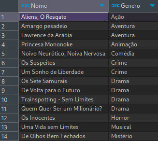
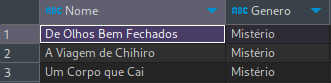
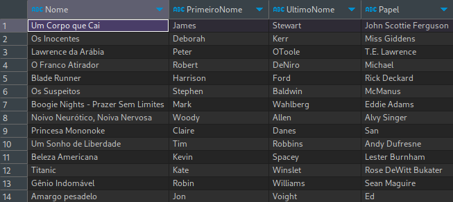

# SqlChanlage-DIO

Consultas SQL para Análise de Dados de Filmes e Atores

Este repositório contém consultas SQL para análise de dados do banco de dados de um site de filmes, onde são armazenadas informações sobre filmes, atores, gêneros, e seus relacionamentos.

## Preparando o Banco de Dados
Para começar, execute o arquivo Script Filmes.sql em seu banco de dados SQL Server. Este script irá criar um banco de dados chamado Filmes, juntamente com as tabelas e dados necessários para realizar as consultas deste desafio. Você pode encontrar o script na pasta Scripts deste repositório ou clicando aqui.

## Consultas Realizadas
Aqui estão as consultas que devem ser executadas para obter diferentes tipos de informações sobre os filmes e atores:

## Proposta
O banco de dados está modelado da seguinte maneira:


As tabelas sao descritas conforme a seguir:

## 1 - Buscar o nome e ano dos filmes
```sql
SELECT Nome, Ano FROM Filmes;
```


## 2 - Buscar o nome e ano dos filmes, ordenados por ordem crescente pelo ano
```sql
SELECT Nome, Ano, Duracao FROM Filmes
ORDER BY Ano;
```


## 3 - Buscar pelo filme de volta para o futuro, trazendo o nome, ano e a duração
```sql
SELECT Nome, Ano, Duracao FROM Filmes
WHERE Nome = 'De Volta para o Futuro';
```


## 4 - Buscar os filmes lançados em 1997
```sql
SELECT Nome, Ano, Duracao FROM Filmes
WHERE Ano = 1997;
```


## 5 - Buscar os filmes lançados APÓS o ano 2000
```sql
SELECT Nome, Ano, Duracao FROM Filmes
WHERE Ano > 2000;
```


## 6 - Buscar os filmes com a duracao maior que 100 e menor que 150, ordenando pela duracao em ordem crescente
```sql
SELECT Nome, Ano, Duracao FROM Filmes
WHERE Duracao > 100 AND Duracao < 150
ORDER BY Duracao;
```


## 7 - Buscar a quantidade de filmes lançadas no ano, agrupando por ano, ordenando pela duracao em ordem decrescente
```sql
SELECT Ano, COUNT(1) Quantidade FROM Filmes
GROUP BY Ano
ORDER BY Quantidade DESC;
```


## 8 - Buscar os Atores do gênero masculino, retornando o PrimeiroNome, UltimoNome
```sql
SELECT * FROM Atores
WHERE Genero = 'M';
```


## 9 - Buscar os Atores do gênero feminino, retornando o PrimeiroNome, UltimoNome, e ordenando pelo PrimeiroNome
```sql
SELECT * FROM Atores
WHERE Genero = 'F'
ORDER BY PrimeiroNome;

```


## 10 - Buscar o nome do filme e o gênero
```sql
SELECT f.Nome, g.Genero FROM Filmes f
INNER JOIN FilmesGenero fg ON f.Id = fg.IdFilme
INNER JOIN Generos g ON fg.IdGenero = g.Id;
```


## 11 - Buscar o nome do filme e o gênero do tipo "Mistério"
```sql
SELECT f.Nome, g.Genero FROM Filmes f
INNER JOIN FilmesGenero fg ON f.Id = fg.IdFilme
INNER JOIN Generos g ON fg.IdGenero = g.Id
WHERE g.Genero = 'Mistério';
```


## 12 - Buscar o nome do filme e os atores, trazendo o PrimeiroNome, UltimoNome e seu Papel
```sql
SELECT f.Nome, a.PrimeiroNome, a.UltimoNome, ef.Papel FROM Filmes f
INNER JOIN ElencoFilme ef ON f.Id = ef.IdFilme
INNER JOIN Atores a ON ef.IdAtor = a.Id;
```

