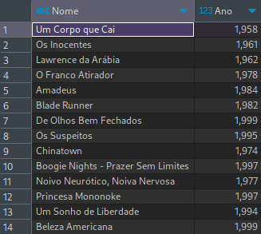
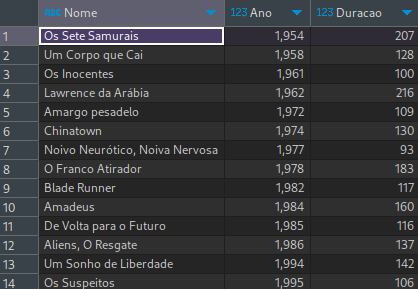
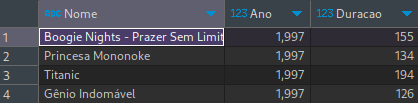

# SqlChanlage-DIO


## Proposta
O banco de dados está modelado da seguinte maneira:


As tabelas sao descritas conforme a seguir:

## 1 - Buscar o nome e ano dos filmes
```sql
SELECT Nome, Ano FROM Filmes;
```


## 2 - Buscar o nome e ano dos filmes, ordenados por ordem crescente pelo ano
```sql
SELECT Nome, Ano, Duracao FROM Filmes
ORDER BY Ano;
```


## 3 - Buscar pelo filme de volta para o futuro, trazendo o nome, ano e a duração
```sql
SELECT Nome, Ano, Duracao FROM Filmes
WHERE Nome = 'De Volta para o Futuro';
```


## 4 - Buscar os filmes lançados em 1997
```sql
SELECT Nome, Ano, Duracao FROM Filmes
WHERE Ano = 1997;
```

