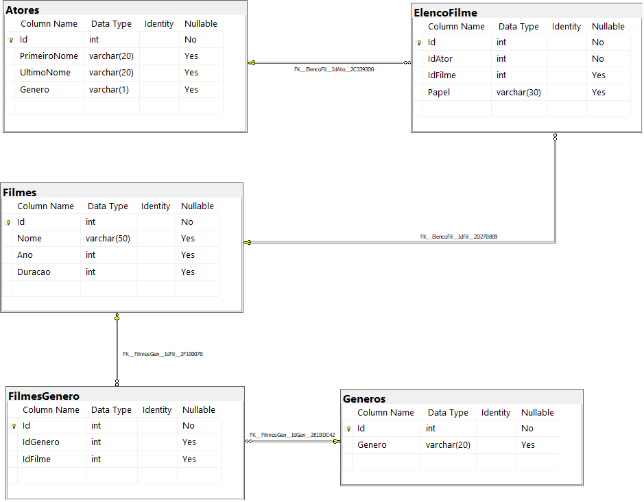
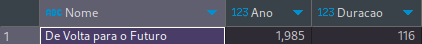

# SqlChanlage-DIO


## Proposta
O banco de dados está modelado da seguinte maneira:



As tabelas sao descritas conforme a seguir:

## 1 - Buscar o nome e ano dos filmes
```sql
SELECT Nome, Ano FROM Filmes;
```


## 2 - Buscar o nome e ano dos filmes, ordenados por ordem crescente pelo ano
```sql
SELECT Nome, Ano, Duracao FROM Filmes
ORDER BY Ano;
```


## 3 - Buscar pelo filme de volta para o futuro, trazendo o nome, ano e a duração
```sql
SELECT Nome, Ano, Duracao FROM Filmes
WHERE Nome = 'De Volta para o Futuro';
```


## 4 - Buscar os filmes lançados em 1997
```sql
SELECT Nome, Ano, Duracao FROM Filmes
WHERE Ano = 1997;
```


## 5 - Buscar os filmes lançados APÓS o ano 2000
```sql
SELECT Nome, Ano, Duracao FROM Filmes
WHERE Ano > 2000;
```


## 6 - Buscar os filmes com a duracao maior que 100 e menor que 150, ordenando pela duracao em ordem crescente
```sql
SELECT Nome, Ano, Duracao FROM Filmes
WHERE Duracao > 100 AND Duracao < 150
ORDER BY Duracao;
```


## 7 - Buscar a quantidade de filmes lançadas no ano, agrupando por ano, ordenando pela duracao em ordem decrescente
```sql
SELECT Ano, COUNT(1) Quantidade FROM Filmes
GROUP BY Ano
ORDER BY Quantidade DESC;
```


## 8 - Buscar os Atores do gênero masculino, retornando o PrimeiroNome, UltimoNome
```sql
SELECT * FROM Atores
WHERE Genero = 'M';
```


## 9 - Buscar os Atores do gênero feminino, retornando o PrimeiroNome, UltimoNome, e ordenando pelo PrimeiroNome
```sql
SELECT * FROM Atores
WHERE Genero = 'F'
ORDER BY PrimeiroNome;

```

